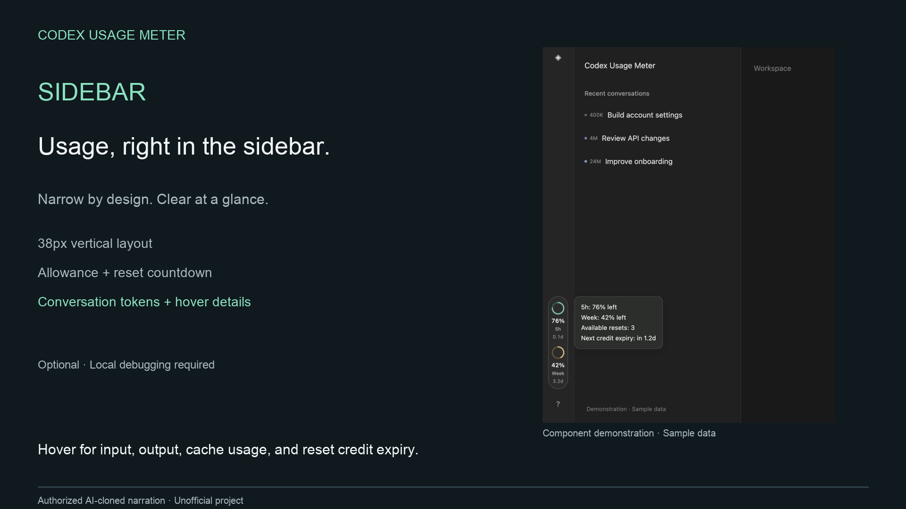

# Codex Usage Meter

**English** | [简体中文](README.zh-CN.md)

A compact Codex sidebar panel for account limits, recent chats, input/output tokens, cache usage, and public reset news. Hover to view; click to pin.

[Watch the demo](https://gnuser.github.io/codex-usage-meter/) · English narration using an authorized voice clone; app captures plus a labeled sidebar demonstration.

## Install with one message

Paste this into Codex:

> Install Codex Usage Meter by following this skill: https://raw.githubusercontent.com/gnuser/codex-usage-meter/main/skills/install-usage-meter/SKILL.md

Codex installs a per-user launcher. Or extract `CodexUsageMeter.zip` and double-click the installer for your OS. Requires Python 3.10+ and Node.js 24+; no native build, hooks, or terminal window needed.

[Manual installation](docs/INSTALL.md)

## Use

- Open **Codex Usage Meter** instead of the ordinary Codex icon.
- Hover the sidebar ring to view the unified panel; click to pin it.
- Click a chat title to open it, or **▸** for usage by model.
- Expand reset news for sources and unconfirmed forecasts.
- Click outside or press **Esc** to close the panel.

Sidebar mode uses a local debugging endpoint and remains experimental; never expose its port. The legacy floating window is available as a fallback in the reference docs.

[Usage & quick fixes](docs/USAGE.md) · [Optional integrations & reference](docs/REFERENCE.md)

Unofficial project. Logs are read locally. Tokens and subscription allowance are different measurements. Do not share panel URLs containing access keys.
