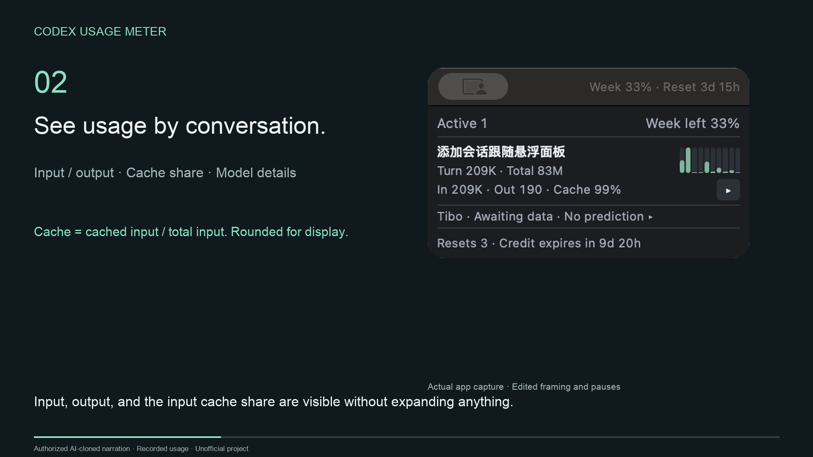

# Codex 用量仪表

[English](README.md) | **简体中文**

用一个小悬浮窗查看 Codex 最近活跃的会话、输入／输出 token 和剩余周额度。不用时收进 **macOS 菜单栏**或 **Windows 系统托盘**。

[观看演示](https://gnuser.github.io/codex-usage-meter/) · 英文克隆旁白，已获本人授权；真实应用画面。

## 一句话安装

把这句话发给 Codex：

> 请按照这个 skill 帮我安装 Codex Usage Meter：https://raw.githubusercontent.com/gnuser/codex-usage-meter/main/skills/install-usage-meter/SKILL.md

Codex 会按系统完成配置。Windows 登录后会自动启动小窗；使用 CLI 时，还可在 `/hooks` 中信任钩子，让发消息时也能打开小窗。

[手动安装](docs/INSTALL.zh-CN.md)

## 使用

- 在 Codex 发消息，最近活跃会话就会出现在列表中。
- 点会话标题，打开对应对话。
- 点 **▸**，查看各模型用量。
- 点额度百分比，查看重置详情。
- 关闭小窗即可收起，从菜单栏或托盘恢复。

[使用与常见问题](docs/USAGE.zh-CN.md) · [可选功能与详细参考](docs/REFERENCE.zh-CN.md)

非官方项目，日志在本机读取。token 用量不等于订阅额度。不要分享含访问密钥的面板链接。
