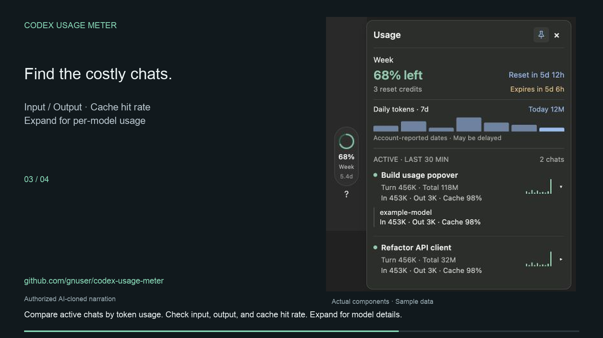

# Codex 用量仪表

[English](README.md) | **简体中文**

在紧凑的 Codex 侧栏面板中查看额度、活跃会话、输入／输出 token、缓存和公开重置动态。悬停查看，点击固定。

[观看演示](https://gnuser.github.io/codex-usage-meter/) · 英文克隆旁白，已获本人授权；当前界面组件与已标注的演示数据。

## 一句话安装

把这句话发给 Codex：

> 请按照这个 skill 帮我安装 Codex Usage Meter：https://raw.githubusercontent.com/gnuser/codex-usage-meter/main/skills/install-usage-meter/SKILL.md

Codex 会安装当前用户的启动入口。也可解压 `CodexUsageMeter.zip`，双击对应系统的安装器。需要 Python 3.10+、Node.js 24+，无需原生编译、hook 或终端常驻。

[下载最新版本](https://github.com/gnuser/codex-usage-meter/releases/latest) · [手动安装](docs/INSTALL.zh-CN.md)

## 使用

- 从 **Codex Usage Meter** 入口打开 Codex。
- 悬停侧栏圆环查看统一面板，点击固定。
- 点击会话标题跳转，点 **▸** 查看模型明细。
- 查看最近七天每日 token，悬停柱子查看具体用量。
- 展开重置动态查看来源和未确认预测。
- 点击外部或按 **Esc** 收起。

侧栏依赖本机调试接口，仍属实验性功能；不要对外开放端口。旧浮窗保留为备用，见详细参考。

[使用与常见问题](docs/USAGE.zh-CN.md) · [可选功能与详细参考](docs/REFERENCE.zh-CN.md)

非官方项目，日志在本机读取。token 用量不等于订阅额度。不要分享含访问密钥的面板链接。

[侧栏技术说明](integrations/sidebar/README.zh-CN.md)
