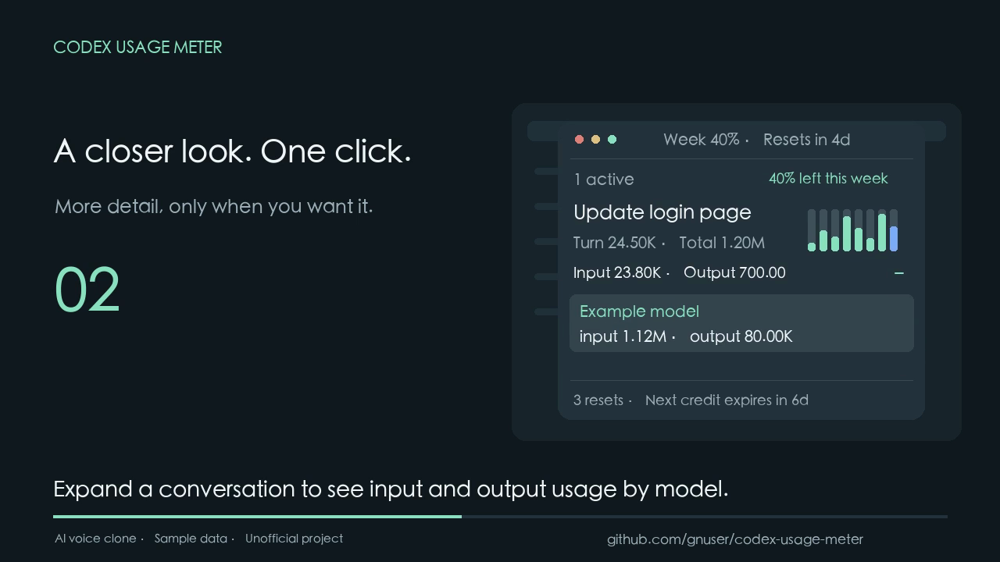

# Reference

**English** | [简体中文](REFERENCE.zh-CN.md)

[Home](../README.md)

Track recent Codex conversations, input and output tokens, and your remaining account allowance in a small floating window. Supports the **macOS menu bar**, **Windows system tray**, a full browser dashboard, and an optional Codex plugin.

This is an unofficial project. **Token usage and subscription allowance are different measurements. A percentage cannot be converted into remaining tokens or a bill.**

The interface defaults to English. Conversation titles and messages retain their original language.

## Get started

- [Installation guide](INSTALL.md): macOS, Windows, and optional integrations.
- [Usage guide](USAGE.md): controls, numbers, and troubleshooting.
- [29-second English overview](https://gnuser.github.io/codex-usage-meter/) · [English subtitles](media/getting-started.srt).

[](https://gnuser.github.io/codex-usage-meter/)

The video covers checking usage, expanding model details, and hiding the window. It uses an authorized AI voice clone, illustrative UI, and sample data. The player also offers an MP4 download. Original recordings and voice models are not included.

## Features

- **Compact conversation list:** conversations with log updates in the last 30 minutes.
- **Usage per turn:** current turn, conversation total, input/output tokens, and bars for the last ten turns. Compact K/M/B/T units with two decimal places.
- **Model details:** expand a conversation to see cumulative input/output usage by recorded model.
- **Conversation links:** click a title to open the corresponding Codex desktop conversation.
- **Account allowance:** remaining allowance and reset times; menu bar or tray updates continue while hidden.
- **Full dashboard:** load history on demand, compare turns and models, expand recorded messages, and export JSON.
- **Optional Tibo monitor:** read the latest three original posts through a paired Chrome extension and show conservative reset signals.

“Active” means a recent log update. It does not mean a conversation is running or in the foreground. Clicking the Codex sidebar alone does not identify the foreground conversation to this tool.

## Choose a setup

| Goal | Setup | Codex plugin required? |
| --- | --- | --- |
| Explore usage and history | Browser dashboard | No |
| Keep a small window visible | macOS / Windows floating window | No |
| Ask Codex about usage in natural language | Codex plugin | Yes |

The dashboard and MCP server use only Python's standard library. The macOS window also needs Swift build tools; Windows needs WebView2 and desktop Python dependencies. Node.js is used for development tests.

## Quick start

Requires Git and Python 3.10+. Account queries require a working, signed-in Codex CLI. Opening conversation links requires the Codex desktop app.

```sh
git clone https://github.com/gnuser/codex-usage-meter.git
cd codex-usage-meter
python3 meter.py serve
```

On Windows PowerShell, use `py -3 meter.py serve`. You can also download the repository ZIP instead of using Git.

Open the complete URL printed in the terminal. Keep the terminal running; press `Ctrl+C` to stop. Do not open `web/index.html` directly. The URL contains a temporary key; do not share it. Restarting the service invalidates old URLs.

Initially, only one recent conversation is loaded. Use **Load 3 more conversations** to load more. Log auto-refresh is off by default; when enabled it refreshes the loaded scope every ten seconds. Account allowance has a separate query button.

For a persistent window, follow the [macOS or Windows installation instructions](INSTALL.md). Keep the source directory: the installed window and hooks depend on its scripts.

## Daily use

| Action | macOS | Windows |
| --- | --- | --- |
| Open a conversation | Click its title | Click its title |
| Resize | Drag the window edge | Drag the window edge |
| Hide | Zoom, minimize, or close button | Close hides to tray; minimize keeps a taskbar entry |
| Restore | Menu bar summary or **Codex Usage** in the Dock | Double-click tray icon or choose **Show usage**; use taskbar if minimized |
| Inspect reset details | Click the allowance percentage | Click the allowance percentage |
| Quit and pause automatic opening | Menu bar context menu | Tray context menu |
| Resume after quitting | Run `floating.py show --thread YOUR_CODEX_THREAD_ID` | Run the same command with the installed Python environment |

Replace `YOUR_CODEX_THREAD_ID` with an actual ID; see [manual opening](REFERENCE.md#open-manually).

The window initially tries to sit near the bottom-right of Codex. If no visible Codex window is found, macOS uses the screen's bottom-right; Windows retains the system default position. You can move it. Clicking a conversation does not automatically hide the window.

Model details start collapsed. Height adjusts to the content, up to 480 pixels or 60% of available screen height; larger content scrolls.

On macOS, a summary such as `▥ 2 · 96.00%` means two recent conversations and the lowest remaining percentage across independent allowance windows. Hover for details. Windows displays the summary in the tray tooltip and menu, not as persistent taskbar text.

### Refresh and reset information

- The title bar shows remaining weekly allowance and time until its automatic reset. The footer shows available manual resets and time until the earliest available reset credit expires.
- Click the allowance percentage to expand exact reset times and credit expiry details. Missing fields remain unknown.
- Conversation data refreshes about every five seconds. Hidden browser pages pause refresh; the desktop checks again when restored. Click the active count to refresh manually.
- Account allowance refreshes when opened and about every five minutes. Clicking the percentage toggles details without waiting for a network query.
- The menu bar / tray refreshes the active count every 15 seconds and allowance every five minutes, including while hidden.
- New messages do not force a hidden window open. Usage may lag until Codex writes its logs.

## Optional Codex plugin

Skip this if you only need the window or browser dashboard. Run `python3 install.py --enable` on macOS, or `.\.venv\Scripts\python.exe install.py --enable` on Windows. The plugin includes a hook: skip the user-level hook installer if using it, or remove only this project's duplicate hook entry. The desktop window must still be installed and the hook trusted.

The installer copies the project to `~/plugins/codex-usage-meter` and registers it in `.agents/plugins/marketplace.json`, preserving existing entries. `--enable` also invokes Codex CLI to enable it; without that option, installation prints the enable command.

Windows installation configures absolute Python paths and Windows hook commands, without requiring `sh` or a `python3` alias. macOS uses `bin/launch`; if Python cannot be found, set the installed `.mcp.json` command to its absolute path, args to `["./meter.py", "mcp"]`, and keep `cwd: "."`.

After enabling, create a new Codex task and ask:

> Show token usage for this conversation.
>
> Open the usage dashboard and check my remaining account allowance.
>
> Open the compact panel for recently active conversations.

| Tool | Purpose |
| --- | --- |
| `usage_snapshot` | Local token statistics and conversation details |
| `usage_account` | Account limits, reset times, and available official usage estimates |
| `usage_dashboard` | Full dashboard, or compact list with `view="panel"` |

Dashboard links expire when the MCP server exits. Ask to open the dashboard again to get a new link.

## Open manually

To skip automatic opening, first list recent conversations and copy the ID at the start of the desired row:

```sh
python3 -c "from usage_meter.ledger import Ledger; print('\n'.join(s['id']+'  '+s['title'] for s in Ledger().catalog(10)['sessions']))"
python3 floating.py show --thread YOUR_CODEX_THREAD_ID
```

On Windows, replace `python3` with `.\.venv\Scripts\python.exe`. Replace `YOUR_CODEX_THREAD_ID` with an actual ID.

This also restores a missing window or resumes paused automatic opening. The window still shows all conversations active in the last 30 minutes, not just the supplied ID.

## Troubleshooting

| Problem | What to check |
| --- | --- |
| Window is missing | Check Dock/menu bar or taskbar/hidden tray icons; then use [manual opening](REFERENCE.md#open-manually) |
| No automatic opening | Install the desktop window, register and trust the hook, then send a message in a new conversation. Resume with `show` if paused |
| Empty list or missing old conversations | Only the last 30 minutes are shown, scanning up to 100 recent conversations. Use the full dashboard for history |
| Tokens work but allowance is `—` | Check Codex CLI sign-in and PATH; set `CODEX_USAGE_CODEX` if needed. API-key sign-in does not guarantee subscription data |
| Clicking a title does nothing | Install Codex desktop and its `codex://` URL handler. Start the Windows window outside WSL |
| Browser cannot connect | Restart the service and use its new URL; the previous port/key may have expired |
| Plugin directory already exists | Use the update procedure below; the installer does not overwrite an existing plugin |

If Windows tray initialization fails, closing the window minimizes it to the taskbar instead, preserving a recovery entry. Windows WebView2 and bridging are covered in CI; real desktop focus, tray placement, and Codex navigation still need device testing.

## Configuration and commands

| Setting | Meaning |
| --- | --- |
| `CODEX_HOME` | Codex logs and state; defaults to `.codex` under the home directory |
| `CODEX_USAGE_CODEX` | Codex CLI executable path, not an entire shell command |
| `CODEX_USAGE_DATA` | Desktop runtime data directory; avoid public/shared directories |
| `meter.py --home PATH` | Override Codex state for one command; place before the subcommand |
| `serve --port PORT` | HTTP port; default `0` chooses an available port |

Runtime data defaults to `~/Library/Application Support/CodexUsageMeter` on macOS and `%LOCALAPPDATA%\CodexUsageMeter` on Windows. Windows uses the current user's directory permissions; macOS key files use mode 0600.

On Windows, replace `python3` below with `py -3` or `.\.venv\Scripts\python.exe`:

```sh
# Open the dashboard for a conversation
python3 meter.py serve --thread YOUR_CODEX_THREAD_ID

# Open a compact browser panel
python3 meter.py serve --thread YOUR_CODEX_THREAD_ID --view panel

# Load four recent conversations as JSON
python3 meter.py snapshot --limit 4

# Query one conversation or account data
python3 meter.py snapshot --thread YOUR_CODEX_THREAD_ID
python3 meter.py account --thread YOUR_CODEX_THREAD_ID

# Use a different Codex state directory
python3 meter.py --home /path/to/codex-home serve
```

## Understanding the data

- **Turn:** recorded usage for the current user turn; it can increase before the final reply reaches the log.
- **Model totals:** attributable log records. These may cover a different scope from cumulative snapshots after compaction or counter resets. Routing aliases such as `jev/auto` remain as recorded; the actual backend model is not guessed.
- **Conversation total:** the latest cumulative snapshot, possibly including resumed or forked history. Snapshots are not summed repeatedly.
- **Local subtotal:** deduplicated loaded records, not the whole account or all devices.
- **Cache and reasoning:** subcategories of input/output; not added a second time. Unknown intervals are not presented as precise model calls.
- **Missing data:** shown as `—` or “Not recorded”, not zero. Charts scale independently; compare numeric values.
- **Allowance:** official account windows cannot be added together or converted into remaining tokens.
- **Costs / credits:** shown only when returned as official estimates, never as a final bill.

See [capabilities and limitations](CAPABILITIES.md).

## Update and uninstall

**Source-based desktop installation:** quit from the menu bar or tray, update the source, and run `native/build.py` for your platform. On Windows, update dependencies first if needed. Run `floating.py show --thread YOUR_CODEX_THREAD_ID` to resume. If script or Python paths changed, remove only this project's old hook entry, then register and trust the new one.

**Installed plugin:** the installation is a copy and does not update when the original source changes. Back up the old copy, update its source, and preserve the Windows-specific absolute paths in `.mcp.json` and hooks. Refresh and enable it using your existing marketplace name:

```sh
python3 tools/read_marketplace_name.py
python3 tools/update_plugin_cachebuster.py ~/plugins/codex-usage-meter
codex plugin add codex-usage-meter@YOUR_MARKETPLACE_NAME
```

Use the actual name printed by the first command. On Windows, use the appropriate Python command and `"$HOME\plugins\codex-usage-meter"`. Create a new Codex task after enabling.

**Uninstall:** quit and pause auto-opening, then uninstall through Codex's plugin page. If a user-level hook was registered, remove only the entry pointing to this project's `floating.py hook`. You can then remove the project copy, dedicated virtual environment, and runtime data directory. Do not delete original `.codex/sessions` logs or unrelated marketplace/hook settings.

## Development and validation

```sh
python3 -m unittest discover -s tests -v
node tests/test_charts.js
node tests/test_panel.js
node tests/test_tibo.js
node tests/test_tibo_timeline.js
node tests/test_tibo_background.js
node tests/test_panel_size.js
node tests/test_quota_summary.js
node --check web/panel.js
```

[GitHub Actions](https://github.com/gnuser/codex-usage-meter/actions) runs tests and platform build/registration on Windows and macOS. Windows also runs `tests/windows_smoke.py` against WebView2, checking page loading, title updates, and the JavaScript-to-desktop bridge. It intercepts system-open calls, without launching real Codex or sending model requests.

HTTP tests need a local listening port. See [validation history](VALIDATION.md) and [helper provenance](../tools/PROVENANCE.md).

## Privacy

Logs are read locally. Pages use no external scripts, fonts, or tracking. The service listens only on `127.0.0.1` and checks Host and a temporary key. Account queries use the local `codex app-server`, without directly parsing authentication files.

The compact list does not return message bodies. The full dashboard and JSON exports may include selected user/assistant messages and account identifiers. Review exports before sharing; do not share URLs containing keys. Original logs are not modified or automatically deleted.

## Optional Tibo reset monitor


1. Sign into X in Chrome and confirm [Tibo's profile](https://x.com/thsottiaux) opens.
2. Open `chrome://extensions` and enable **Developer mode**.
3. Select **Load unpacked** and choose this repository's `browser-extension` directory.
4. With the floating window running, get its **background service** URL:

   ```sh
   python3 -c "import json; from floating import runtime_dir; print(json.loads((runtime_dir()/'connection.json').read_text())['url'])"
   ```

   On Windows, replace `python3` with `.\.venv\Scripts\python.exe`. If the file does not exist, open the floating window first.

5. Click the Chrome extension icon, paste the complete URL, and choose **Connect and start**.
6. Wait for **Updated**, then expand the Tibo row in the window. New data may take about 30 seconds to appear in the panel.

Use the floating window's URL above. Running `meter.py serve` separately starts a different service; pairing with it will not update the existing floating window.

The extension refreshes every 30 minutes; **Refresh now** runs it manually. Keep Chrome and the dedicated X tab open. Pair again after restarting the usage service. Do not share the connection URL. Only the latest three original posts are considered; replies, self-replies, and reposts are excluded.


 The monitor is free and requires the repository's extension; merely signing into Chrome is not enough. It reads the latest three original posts from [Tibo](https://x.com/thsottiaux), excluding replies, self-replies, reposts, recognized pins, and other authors. Quoted content is not treated as his own statement.

A dedicated X tab uses the signed-in page's own public timeline response. The extension does not read/export cookies, access private messages, or make extra X API calls. Chrome permissions are domain-wide, but collection is limited to the dedicated page. Only public post content, timestamps, and identifiers are sent to the local service. Pairing exchanges the panel key for a write-only post key; the extension does not retain the panel's read key. Re-pairing invalidates the old write key.

The tab refreshes every 30 minutes; manual refresh is available. Chrome must remain running, and sleeping devices do not refresh on schedule. Service restarts require pairing again. The reader supports UserOriginalsTimeline / UserTweets responses and persists its cycle across extension worker sleep; a missing complete result after one minute produces a failure status.

Incomplete data, sign-in expiry, verification challenges, truncated long posts, fewer than three posts, changed response formats, and stale data suspend predictions. The parser depends on X's response structure and cannot guarantee completeness. Last known content remains visible with its update time.

Signals are **Author announces reset**, **Author reports reset or rollout**, **Possible signal · Unconfirmed**, or **No clear reset signal**. These are conservative text rules, not probabilities. Relative phrases such as “tomorrow” or “Tuesday” remain quoted without inventing dates or time zones. Public posts do not confirm that your account received a reset; check the official allowance data.
